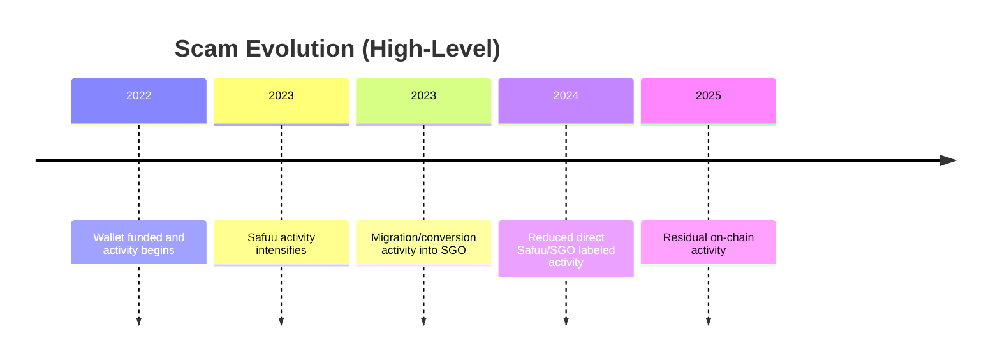

# Fraud Analysis Report

## Background
- This wallet analysis indicates a pattern of repeated onboarding through exchange-linked wallets followed by high-frequency project interactions.
- Prior to Safuu, the same actor appears to have operated fraudulently under a different name. Detailed pre-Safuu project naming has been intentionally omitted per request.
- Analysis window: `2022-02-10 14:19:39` to `2025-10-12 17:10:19` (UTC).

## Timeline (Visual)
- Monthly paid-in from exchange-linked inflows is in `fraud_company_timeline_monthly.csv`.
- Exact boundary dates are listed above.

## Evolution Narrative
- The data supports a migration pattern where funds attributed to Safuu-related flows are later seen in SGO-related flows.
- These are not always fresh cash injections; many rows represent reallocation/conversion events (e.g., Safuu to SGO) rather than new external money.
- Evidence for explicit Vulcan/Vitruveo token-touch in this wallet is limited in the available transactions; where present it is much smaller than Safuu/SGO flow.

## Lite Nodes
- A distinct on-chain label for "Lite Nodes" was not found in the scraped rows.
- Your stated estimate (about £1,500 total for 5 Lite Nodes) should be treated as user-supplied evidence pending supporting receipts/invoices or contract-level decode evidence.

## Documentary Reference
- Coffeezilla video (Safuu investigation): [Scammer BEGGED Me Not to Investigate](https://www.youtube.com/watch?v=38RBRPwODUk)
- Transcript summary: Not provided in this workspace. Add the transcript text and this section can be replaced with a structured summary with key claims and timestamps.

## Summary Table (USD)
| Group | Money In (USD then) | Money Out (USD then) | Net (USD then) | Money In (USD today) | Money Out (USD today) | Net (USD today) |
|---|---:|---:|---:|---:|---:|---:|
| binance | $71,372.04 | $38,691.20 | $32,680.84 | $72,427.30 | $39,263.23 | $33,164.07 |
| safuu | $0.00 | $0.00 | $0.00 | $0.00 | $0.00 | $0.00 |
| sgo | $0.00 | $0.00 | $0.00 | $0.00 | $0.00 | $0.00 |
| stablecoin | $0.00 | $0.00 | $0.00 | $0.00 | $0.00 | $0.00 |
| other | $12,067.23 | $213,117.78 | $-201,050.55 | $12,244.00 | $216,268.11 | $-204,024.11 |
| TOTAL | $83,439.27 | $251,808.98 | $-168,369.71 | $84,671.30 | $255,531.34 | $-170,860.04 |

## Summary Table (GBP)
| Group | Money In (GBP then) | Money Out (GBP then) | Net (GBP then) |
|---|---:|---:|---:|
| binance | £59,037.83 | £32,167.31 | £26,870.52 |
| safuu | £0.00 | £0.00 | £0.00 |
| sgo | £0.00 | £0.00 | £0.00 |
| stablecoin | £0.00 | £0.00 | £0.00 |
| other | £9,499.38 | £171,861.16 | £-162,361.78 |
| TOTAL | £68,537.21 | £204,028.48 | £-135,491.26 |

## Token-Level Scam Exposure (Requested Token List)
| Token | Into USD (then) | Out USD (then) | Net USD (then) | Internal Transfer USD (est) | New Money Into USD (est) |
|---|---:|---:|---:|---:|---:|
| SAFUU | $68,945.36 | $0.00 | $68,945.36 | $0.00 | $68,945.36 |
| SAFUUX | $0.00 | $0.00 | $0.00 | $0.00 | $0.00 |
| SGO | $56,200.03 | $0.00 | $56,200.03 | $0.00 | $56,200.03 |
| VUL | $0.00 | $0.00 | $0.00 | $0.00 | $0.00 |
| VITRUVEO | $0.00 | $0.00 | $0.00 | $0.00 | $0.00 |
| SFU | $0.00 | $0.00 | $0.00 | $0.00 | $0.00 |
| SFX | $0.00 | $0.00 | $0.00 | $0.00 | $0.00 |
| VTRX | $0.00 | $0.00 | $0.00 | $0.00 | $0.00 |

## Interpretation Guidance
- `Money Into Token` can include internal conversions. It is not always new external capital.
- `Estimated Internal Transfer` flags probable reallocation chains (e.g., Safuu->SGO).
- `Estimated New Money Into` attempts to isolate fresh capital exposure per token by subtracting overlap.

## Raw Data Dump
- Full CSV with detailed fields: `fraud_company_raw_data_dump.csv`